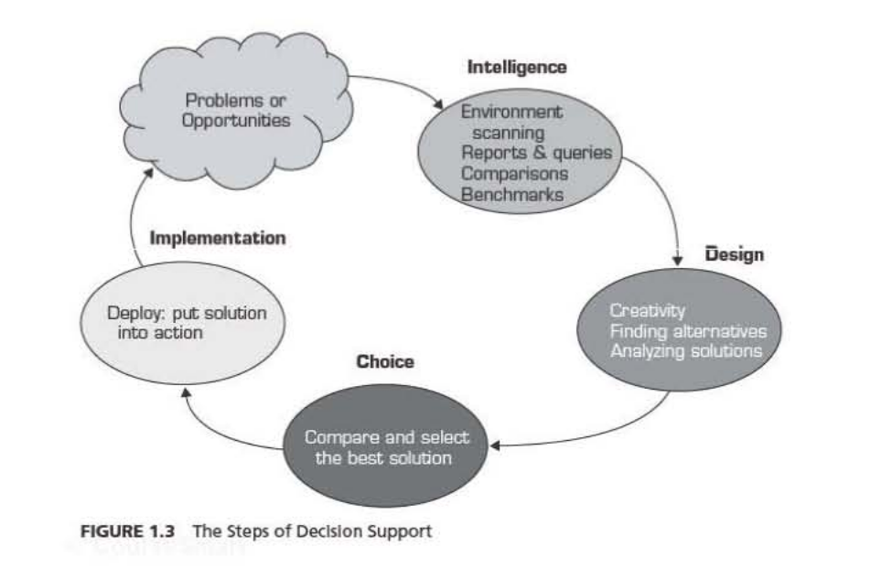

###Chapter One: Decision Support and Business Intelligence Systems

####**1.1 Business Pressures - Respones - Supports Model**

* **Pressures** : Results from bussines climate or challenges 
* **Respones** : Actions taken to response the pressures
* **Supports** : computerized tools used to solve or support the pressures

####**1.2 Decision Making Process**

1. Define the problems.
2. Construct the model that describe the problems.
3. Identify the possible solution to the modelled problem  and evaluate the solutions.
4. Compare, Choose, and recommend the a potential solution to the problem.

#### **1.2 Simon's Four Decision Making Process Phase**

1. **Intelligence** : searching for conditions thats call for decisions.
2. **Design** : inventing, developing, and analayzing possible alternative course of actions.
3. **Choice** : selecting the course of action from among those available.
4. **Implementation** : adatpting the selected course of action to the decision situation.

####**Decision Support System (DSS)**
* An interactive computer based system, which help decision makers utilize data and models to solve unstructured and semi-structured problems.

* **Structured Problem** : Highly repetitve tasks or decisions for operational manager.
* **Semi-structed Problem** : combination of structured and unstructured tasks especially for middle level or tactical managers.
* **Unstructured Problem** : normally make the decision by stragtic or top level managers

